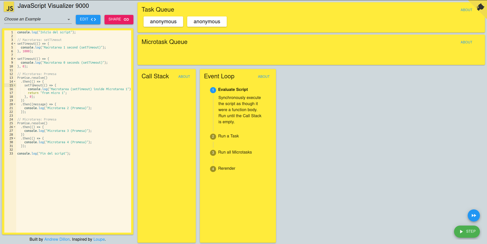
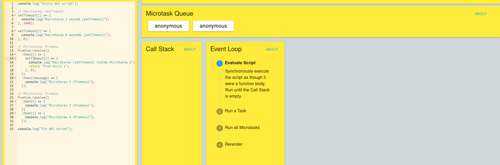
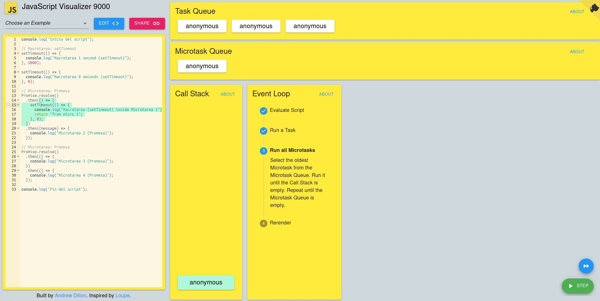

console.log("Inicio del script");

// Macrotarea: setTimeout
setTimeout(() => {
  console.log("Macrotarea 1 second (setTimeout)");
}, 1000);

setTimeout(() => {
  console.log("Macrotarea 0 seconds (setTimeout)");
}, 0);

// Microtarea: Promesa
Promise.resolve()
  .then(() => {
    setTimeout(() => {
      console.log("Macrotarea (setTimeout) inside Microtarea 1");
      return "from micro 1";
    }, 0);
  })
  .then((message) => {
    console.log("Microtarea 2 (Promesa)");
  });

// Microtarea: Promesa
Promise.resolve()
  .then(() => {
    console.log("Microtarea 3 (Promesa)");
  })
  .then(() => {
    console.log("Microtarea 4 (Promesa)");
  });

console.log("Fin del script");
-----------------------------------------------------------------------
responde las siguientes preguntas:

    - ¿Qué tareas se consideran macrotareas y cuáles son microtareas?
    Estas son las macro tareas las que tienen menor prioridad en el evenloop
    

    Y estas son las microtareas
    

    - ¿Cómo se relacionan las macrotareas y microtareas con el event loop?
    El evenloop es el que las clasifica y las reparte dependiendo de la prioridad de cada una

    ¿Qué sucede cuando una microtarea genera una nueva macrotarea dentro de ella?
    Se ejecuta la microtarea y la macrotarea que hay dentro se ejecuta con las macro
    

    ¿Cómo se manejan las promesas y los setTimeout en relación con el event loop?
    las promesas son microtareas y los setTimeouts son macrotareas 